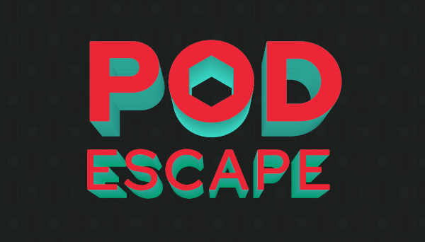

  

  
  

## Introduction

Endless runner of a pod trying to escape from a project being deleted.

## Table of Contents

- [Prerequisites](#prerequisites)
- [Contributing](#contributing)
- [Documentation](#documentation)
- [Support](#support)
- [License](#license)

## Prerequisites

- Godot >= 3.2

## Contributing

Contribute with the game is very simple. All that you need is to:

1. Fork the repository
2. Do your changes
3. Push it to your repository
4. Create a pull request

## Documentation

You can find some other documentations in our [wiki](https://github.com/CodeCafeOpenShiftGame/PodEscape/wiki).

## Support

If you need any help or if you found a bug, open a issue and we will be happy to answer you.

## License

This project is licensed by the Apache License 2.0. For more information check the LICENSE file.